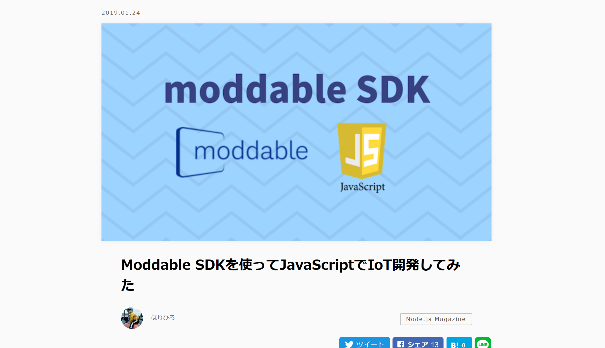
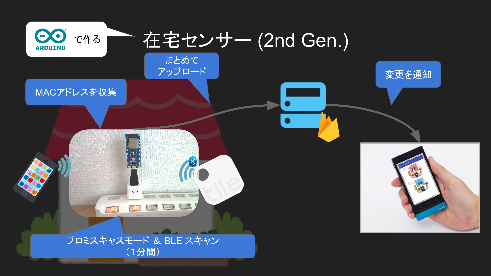
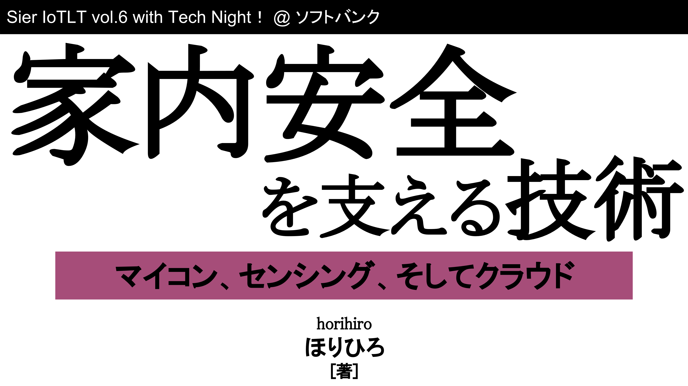
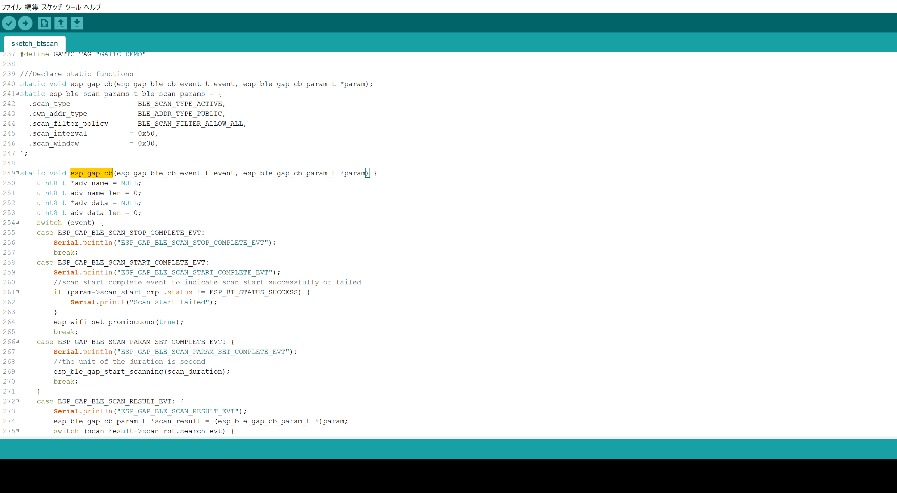
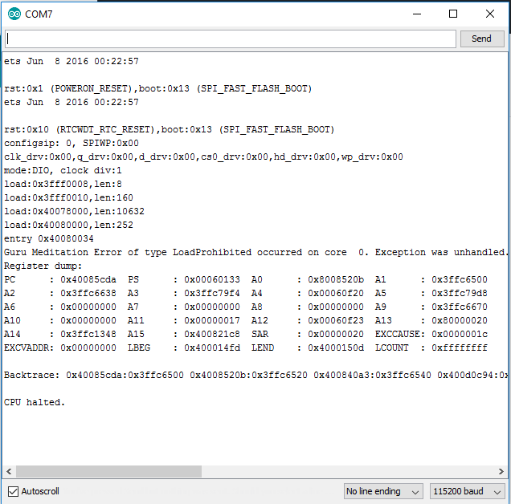
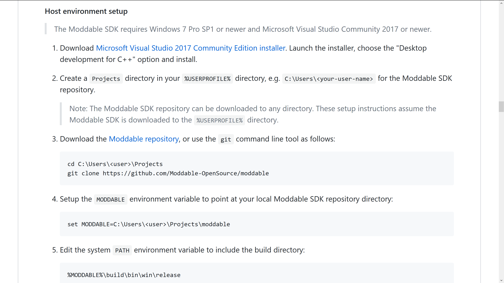
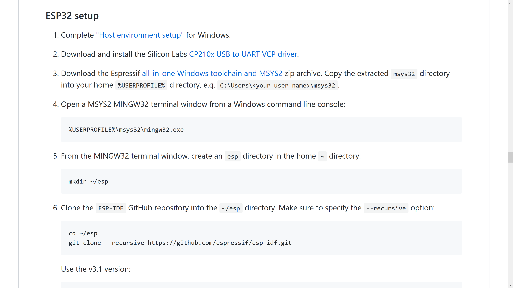
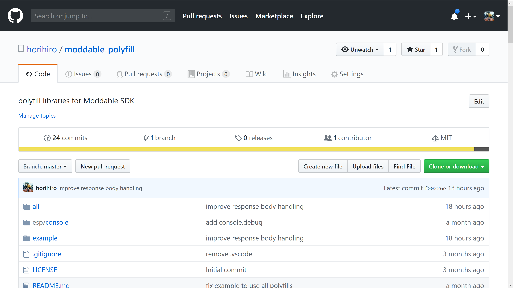

<style>
  .slides {
    width: 100% !important;
  }
  .reveal pre {
    display: -webkit-flex;
    display: flex;
    -webkit-justify-content: center;
    justify-content: center;
    -webkit-align-items: stretch;
    align-items: stretch;
  }
</style>

# Moddableで<br>簡単IoT
🎉 IoTLT vol.50 🎉
<br>@ DEJIMA

<div style="position:fixed; right:0; bottom:0; font-size: large; margin: 15px;"> powered by reveal.js/vscode-reveal</div>

---

## 自己紹介
- 名前
  - ほりひろ<br>
- 職業
  - Azure (PaaS製品)のサポートエンジニア
  - "dotstudio の技術顧問" (なにも役立ててない...)

---

## ちなみに
今回は vscode-reveal でスライド作ってみました。

---

# Moddable SDK
- ECMAScript(Javascript) で<br>esp 系のマイコン実装ができる
- 多分マイナー

--

## IoTLT でも何度か登場
- わみさん @ IoTLT 名古屋 vol.9 
- 小坂さん @ SIer IoTLT vol.14

--

## dotstudio でブログ書いた
https://dotstud.io/blog/developed-iot-using-moddable/ <br>



---

# 何か作って<br>使い勝手を見てみる

--

## 昔のネタの焼き直し
<div style="position:relative; width:60%; margin-left: 20%">
  
  
</div>
を Moddable SDK で再実装してみた

---

# Arduino SDK での実装

--

## いっぱい書いてた思ひ出


--

## Wi-Fi と BLE の同時利用に<br>手こずった思ひ出


---

# 一方<br>Moddable SDK での実装

--

## BLE スキャン処理

```
const bleAddrList = {};
class Scanner extends BLEClient {
  onReady() {
    scanner.startScanning();
  }
  onDiscovered(d) {
    const hexString = Array.prototype.map.call(
      new Uint8Array(d.address), x => `00${x.toString(16)}`.slice(-2)
    ).join('');
    bleAddrList[hexString] = Date.now();
  }
}
const scanner = new Scanner;
```

--

## BLE アドレスの POST 処理

```
const postBleAddress = () => {
  setTimeout(() => { // <- polyfill
    const body = JSON.stringify(bleAddrList);
    // HTTP POST request
    fetch(URL, {method: 'POST', body, ...}) // <- polyfill
      .then(/* onSucceeded */).catch(/* onFailed */)
      .then(postBleAddress);
  }, INTERVAL);
};
postBleAddress();
```

--

## この２つをくっつけて完成
細かい制御は全く記述してない

--

# 簡単🤗

---


## 当然いいことばかりではなく<br>イケてない点も

---

# イケてない点<br>その１

--

## 環境構築がめんどい

基本は手順通りで出来るけど、、、





--

## 外部ツールのパスが決め打ち

変えることは可能

でも変え方は書いていない

---

# イケてない点<br>その２

--

## 最初のビルドがクソおっそい🐢

--

## ⏳⏳5-10 分かかる⌛⌛

---

# イケてない点<br>その３

--

## クラス／オブジェクトが無い
- ブラウザー／Node.js ではおなじみの。
  - console
  - XMLHttpRequest／fetch
  - タイマー系 (setTimeout 等)

--

## W3C/WHATWG 由来のモノは<br>提供されていない
- 規格の制定元が違うという大人の事情

--

## polyfill ライブラリー<br>はじめました
https://github.com/horihiro/moddable-polyfill<br>


---

## 興味がある方人がいましたら<br>情報交換しましょう

---

# 終
<font style="border-bottom: 5px solid white;">制作・著作</font><br>
<div style="position: relative">
  <font style="line-height: 1.8em;position: absolute;top: 0;left: 0; width: 100%;letter-spacing: 0.35em; font-size: 0.8em;">ほりひろ</font>
  <font style="line-height: 1.8em;position: absolute;top: -0.2em; left: -0.1em; width: 100%;">◯◯◯◯</font>
</div>
