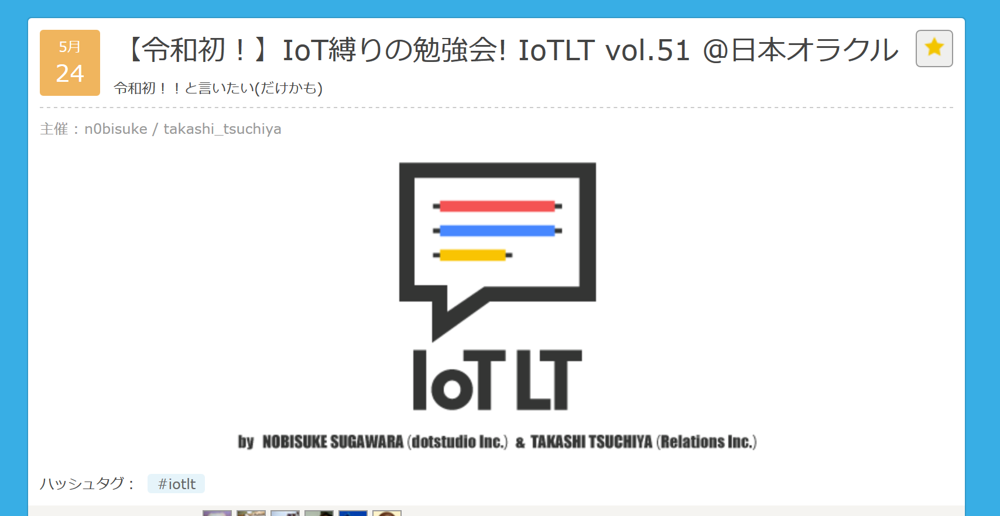
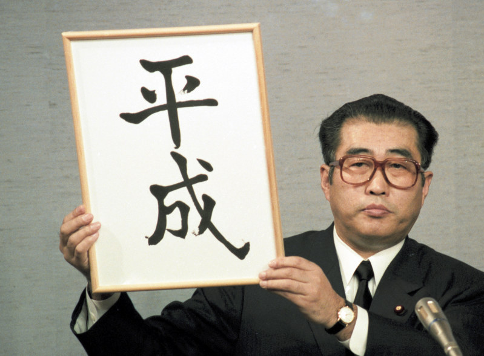
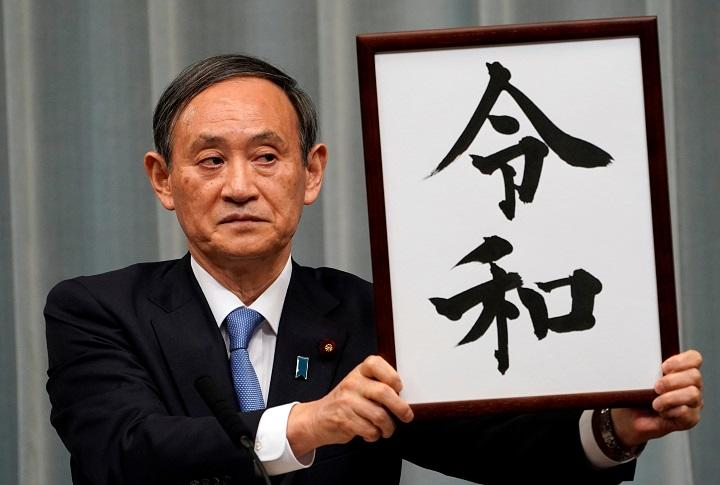
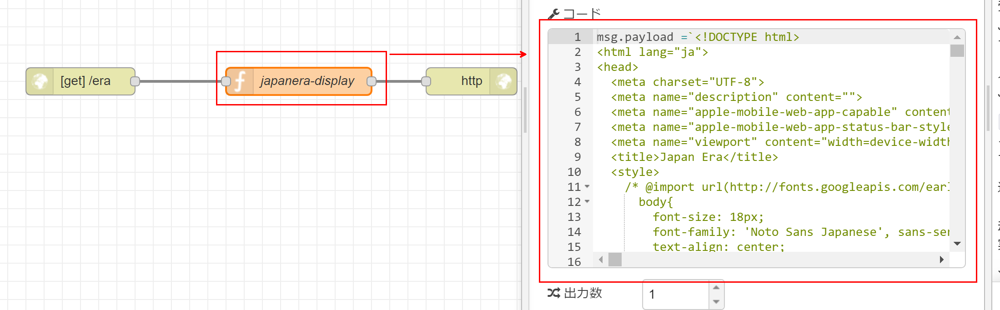
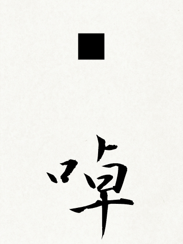
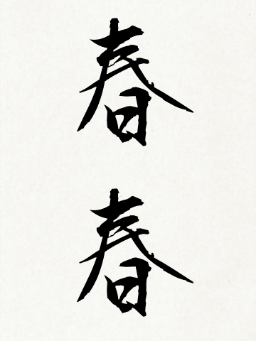
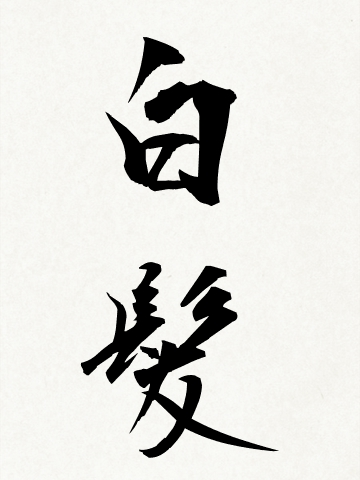

# 夢を叶える  ~~IoT~~ enebular
~~IoTLT vol.51 @ 日本オラクル~~ 
~~enebular meetup vol.11~~ 
ノンコーディングで IoT する LT 会 @ ウフル

 powered by reveal.js/vscode-reveal

---

## 自己紹介
- 名前:ほりひろ 
- 職業
  - Azure (PaaS製品)のサポートエンジニア
  - 『dotstudio 技術顧問』 
    \# この会社の技術顧問て、、、

---

## 早速いいわけ

--

※5/24 の IoTLT で喋る筈だった LT を いろいろワケあって ここでします

https://iotlt.connpass.com/event/128933/

皆様お誘い合わせの上、ぜひご参加ください

--

# 全力で コーディング しました 🙇‍🙇‍🙇‍

--

# LT ツール／スタイル、 という点をお楽しみください

---

# 本題

--

# 夢 叶えていますか？

--

# 日本に住むなら 一度はやってみたい

--

# それは、、、

--

# 元号発表！

  
  

--

# やったことある人🖐

---

# 新元号発表ガチャ ツールを作った

--

# できること

--

## 元号発表ごっこ

--

## 作った元号の出典

<section>

 ↓ これは InfoMotion で作成

</section>
<iframe src="https://create-japan-newera.herokuapp.com/era-meta" style="background: white; width: 80%; height: 400px;"/>

--

## つまり
- 漢字二文字をランダムに生成
- 元号発表ぽいに筆文字で描画
- 出典も確認可能

---

## 材料

<section>
<ul>
  <li>
enebular
</li>
  <li>
Firebase
</li>
  <li>
️️️️Web書道.com
</li>
  <li>
️️️️タブレット (今回は iPad)
</li>
  <li>
💪やる気＆ゴリッゴリのコーディング

      
# あれ、Azureがない
</li>
</ul>
</section>

---

# 頑張った ポイント

--

## 出典元
- きちんと万葉集から引用 
  -> 歌の抽出 
  -> 漢字の抽出

--

## 徹底的な enebular 縛り
<section>
<ul>
  <li>
ロジック

    <ul>
      <li>
        
enebular の function で実装

      </li>
    </ul>
  </li>
  <li>
UI

    <ul>
      <li>
        
enebular の infomotion で実装

        
-> enebular の function で HTML を配信 
        

      </li>
    </ul>
  </li>
</ul>
</section>

---

# 頑張らなかった ポイント

--

## 頭文字チェック
- MTSHR と重複する可能性あり

--

## フォントチェック
- たまに描画できない文字 
  -> 目視で確認
- 失敗例
  

--

## 重複文字、熟語チェック
- 同じ文字が抽出
- 既に使われている単語
  

---

# 機会がありましたら 是非ご活用ください
